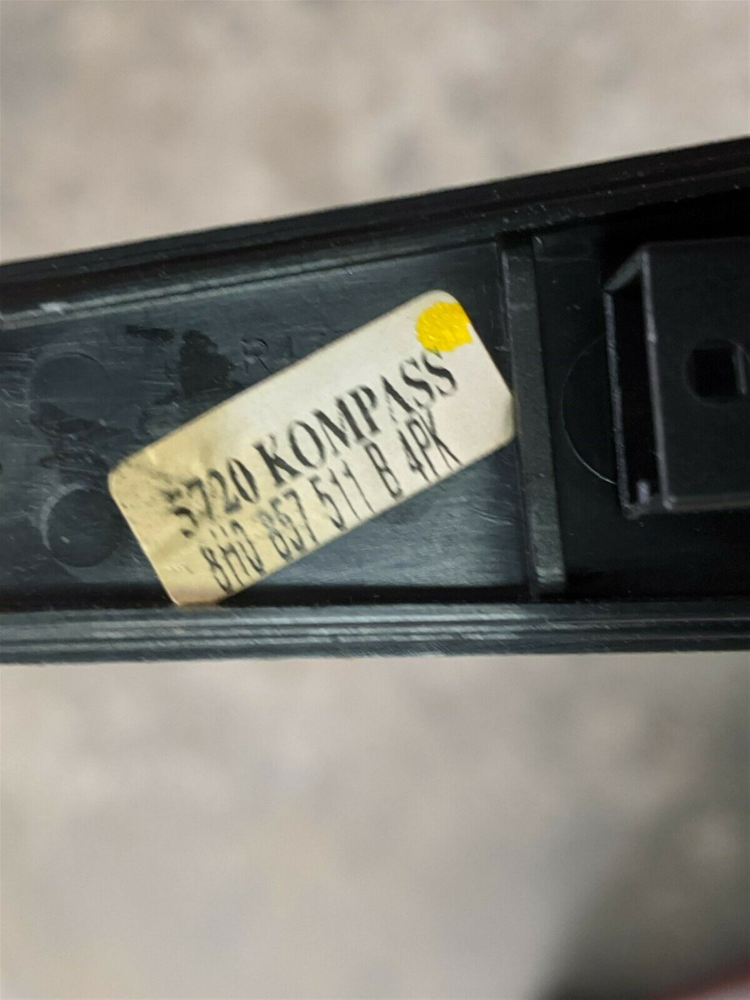
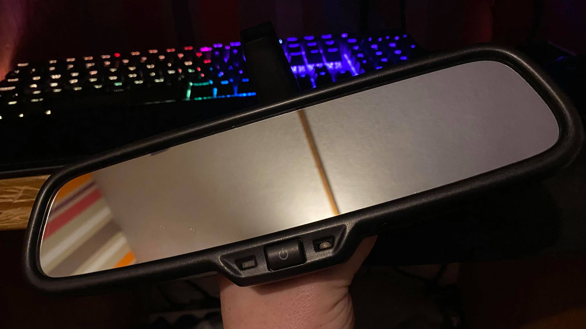
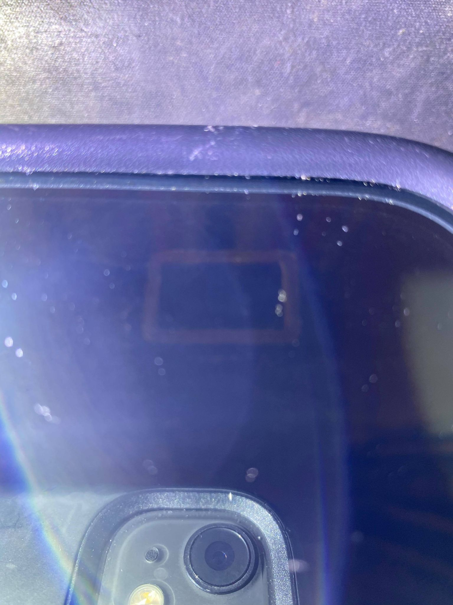
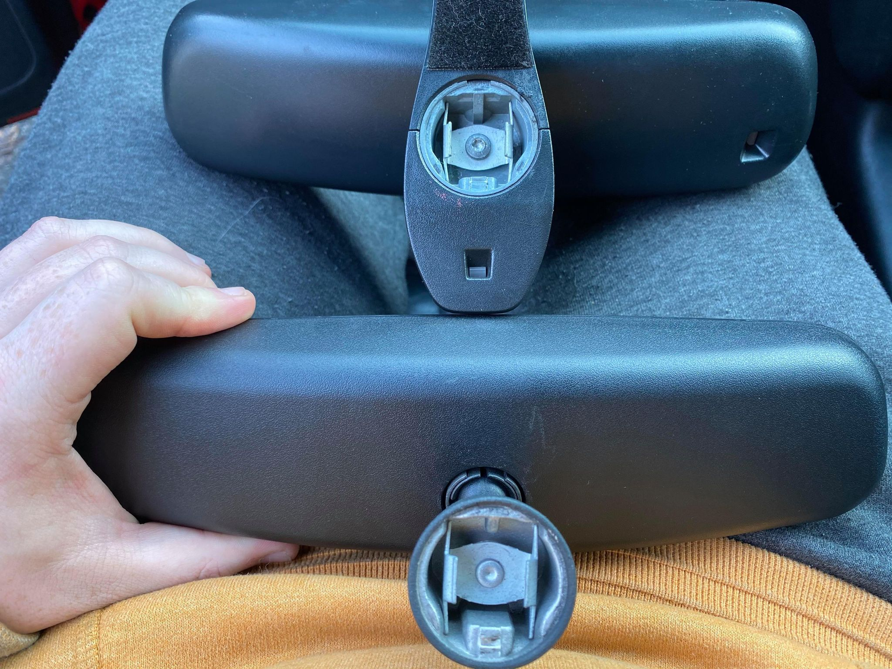
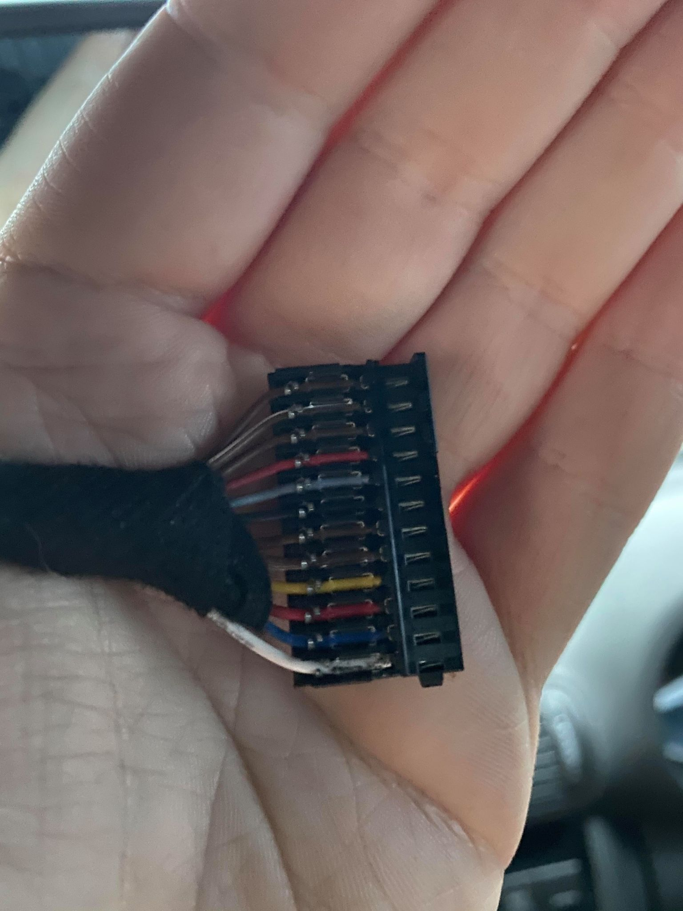
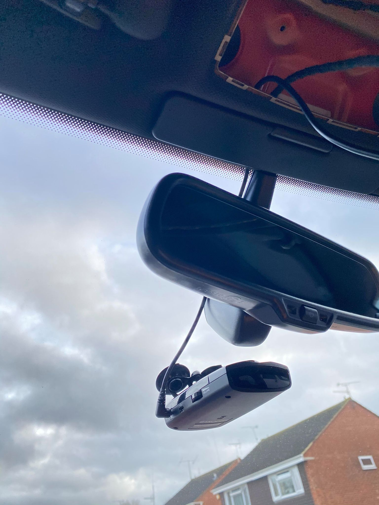
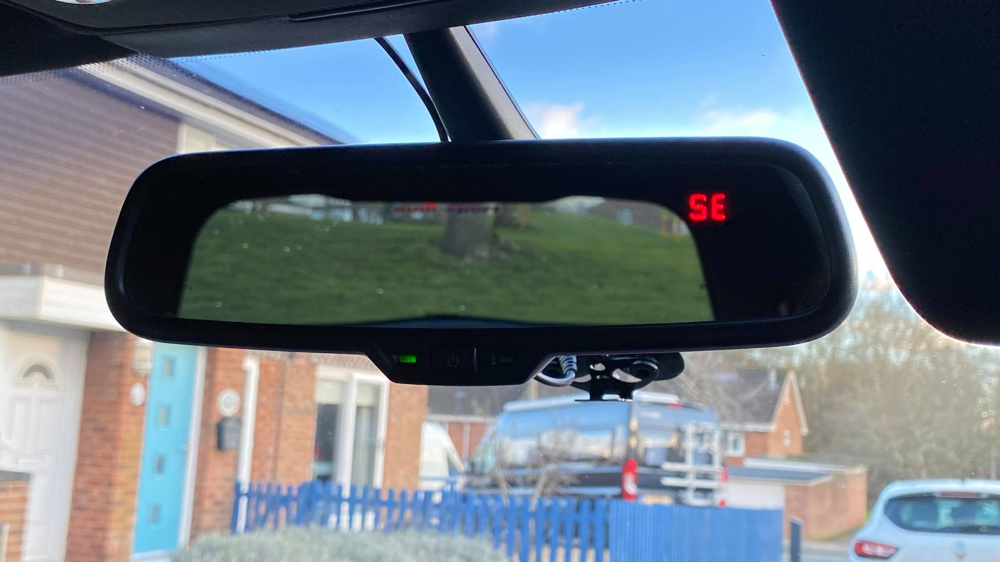
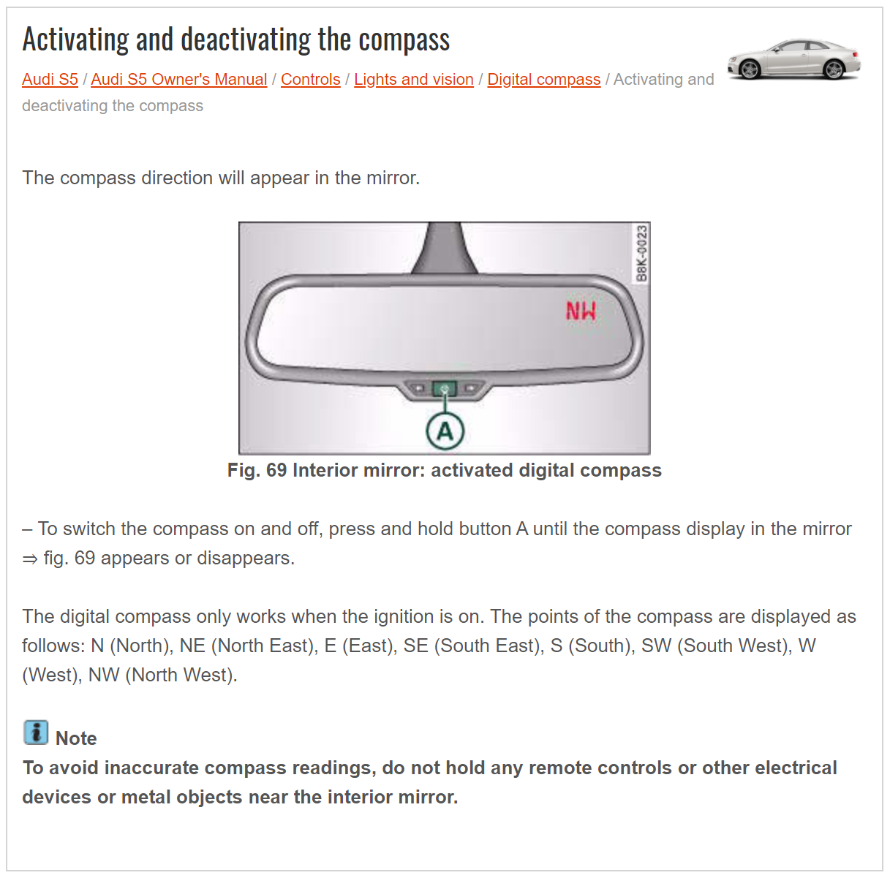
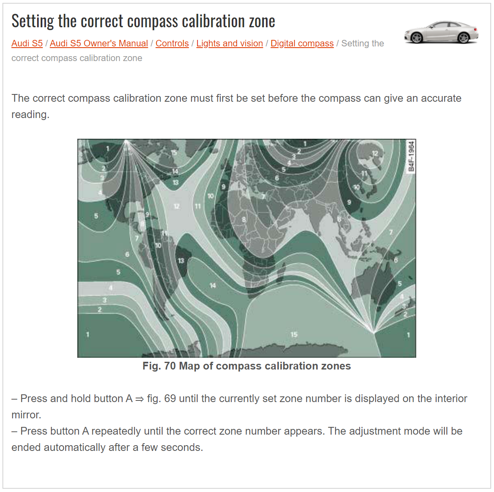
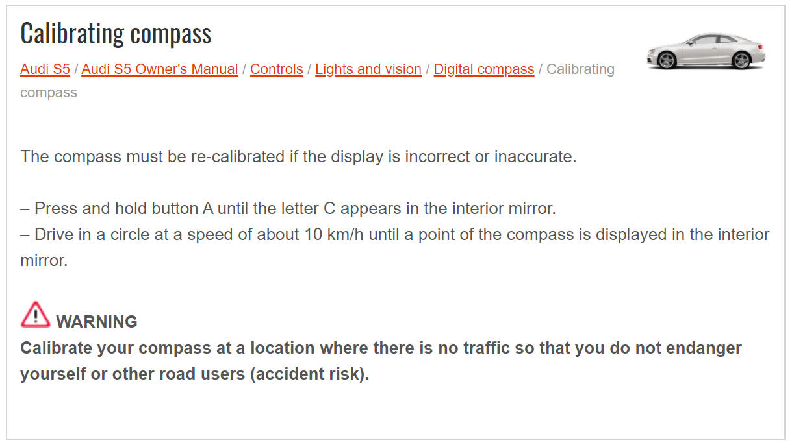

# Auto Dimming Mirror + Compass retrofit

Thought i'd post up here if anyone is interested in retro fitting an auto dimming rear view. If you already have auto dimming mirrors and want to get a compass mirror then it should be plug and play

So wasn't that interested in swapping out to just an auto dimming but after seeing some info about US S4 B6 cabriolets having a digital compass fitted to it and that they were straight fit into S3 8Ls I kinda liked the idea of trying it out. Part number is 8H0 857 511 B but i think that covers non compass as well so you need to make sure you get the right one if you decided to do it. has a sticker on the inside that says kompass on it ,though I'm not sure why it's spelt with a K 

Tracked down a unit off eBay from Tennessee and thankfully eBay makes international shipping very easy. In total with shipping and import fees i paid just under £80 all in.

As you can see with it turned off there is no sight of a cutout for the compass unless you get the right angle up close which i really like

You can see the mounting point is the same

Now onto getting it wired in, didn't find a ton of info out there about it but found enough to get me started and then figure out the rest along the way. The plug on the mirror has 6 pins and from what i gathered you can wire 2 wires to make it work or 4 to get to get it fully working.

The connector you need to plug into the mirror is 4B0 971 833 and i used some 0.5mm thinwall wire to wire it all in. Found a few wiring diagrams which were saying different things from each other so i played around with a spare battery to figure out what is needed.

Pin 1 Ignition Live
Pin 2 Ground
Pin 4 reverse signal (needs a ground to work)
Pin 6 Interior light (needs a ground to work)
Pin 3-5 leave blank (I believe these are signal wires that go to the left and right wing mirrors
on some models of Audi that have auto dimming wing mirrors)

So it will work with just power and ground but adding pins 4-6 will disable the auto dimming when you put the car into reverse or you turn on the interior lights. Going off diagrams i wired pin 6 into pin 1 of the interior light plug and ran wire for pin 4 to the glovebox but blanked it off there until i figure out where i need to splice it into.

decided to also run the hardwire for my detector at the same time

Everything back together now and all working after some calibrations. I do quite like having a
compass there, don't actually have a need for it but i guess it's just satisfying having the extra feature

here is some calibration info that i found for the compass mirror on an S5 but after testing it does
also work the same for the A4 one

For the UK you want to set it to 9

