# Double Din Fascia install

Thought i would put up a little guide on what i did to get a fascia to fit a double din aftermarket head unit.

edit* you will need an original S3 double din housing to start with, i got mine through someone breaking their S3. They do come up on eBay every now and then but are not the cheapest things.

Started off with getting an audi A4 B6 fascia which from what I found after searching is the closest fit to the S3. I decided to go with Connects2 CT24AU16 cheap enough and seems to be the popular one to get.

First fitment shows that it the top slides in but is very tight and you can see how much need to be cut at the bottom of it.

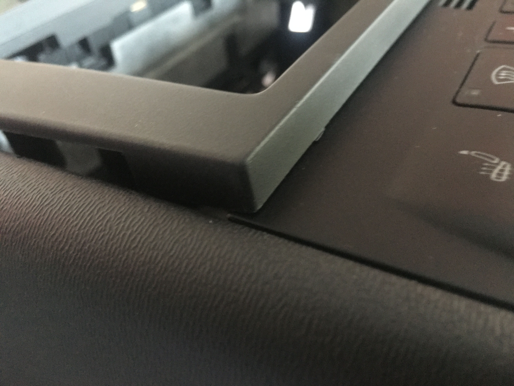

So went about first sanding down the edges on the top of both side until it would slot in without much effort and the top piece wouldn't bend

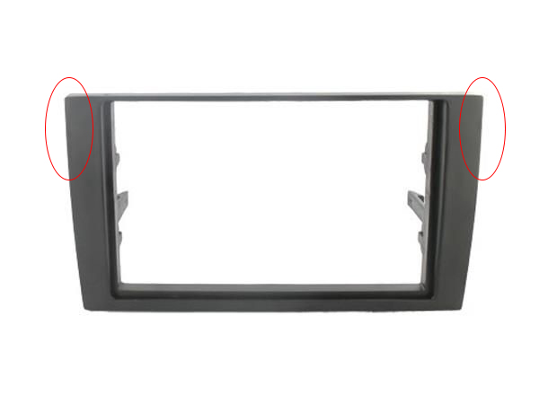

After that i measured up how much i needed to cut off the bottom, about 4mm need to be cut off so went with 3.5mm which i cut with a cutting disc on a dremal. the dremel leaves it very messy so snapped off all the melted bits then moved on to sanding it down that last .5mm, taped the sand paper to the table so i had a nice flat surface and when i was going over it i kept it perfectly flat to not curve the edges.

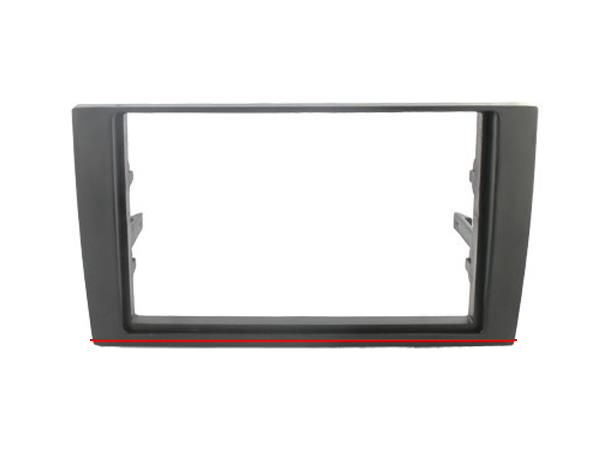

Once i was happy with the bottom fitment i notice the top was not sitting as flat as i wanted.

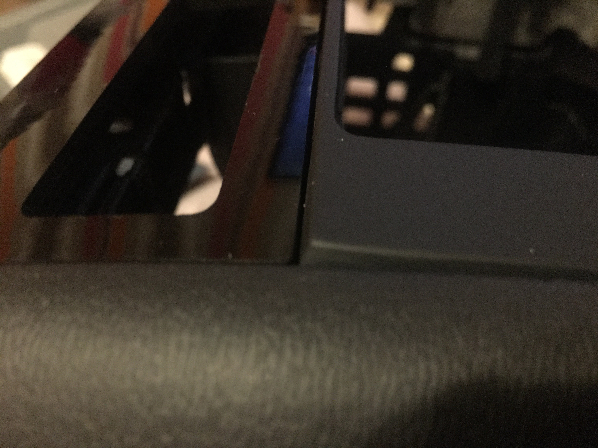

Looked at what it was sitting on to see if i could take it down some, was catching on some metal bits on the housing and also a little bit at the top of the fascia. Decided to cut 3.5mm from the top corners which seemed just about right.

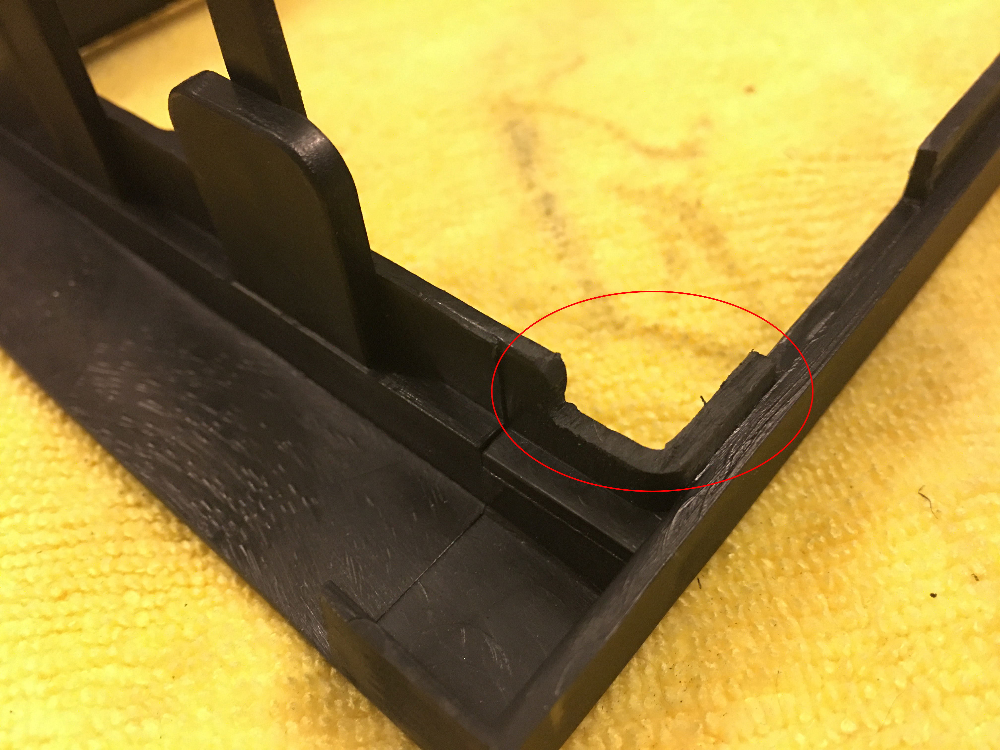

Onto the housing, this bit i didn't like the most but turned out alright tbh. So there was 2 bits of metal that needed trimming down which i used a sanding drum dremal bit which took it down easy enough. While i was there i noticed 2 other bits of metal hanging down from the top that are gonna interfere with the double din cage. So also took the sanding drum to those as well and just smoothed them down.

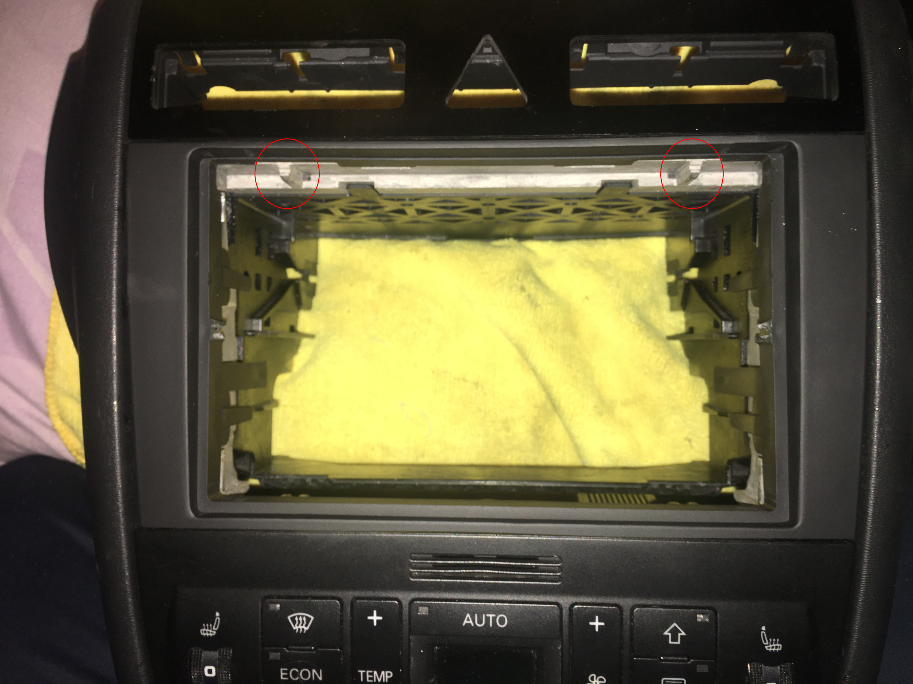
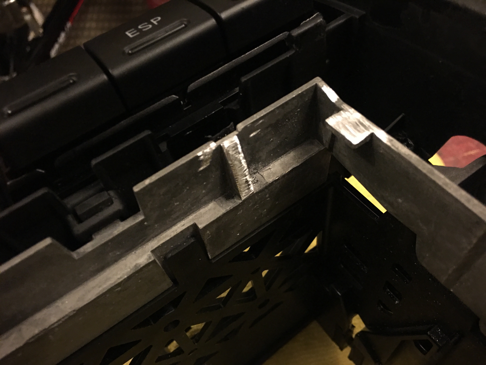

With all that done everything sit flush and i'm happy with the fitment. Fitted the cage and notice it was bowing in on both sides, after i pulled it back out you could see there was some material on the inside of the fascia so a bit of sanding with the sanding drum again and cleaned it up.

And with that fitted the cage and slotted the head unit in, all still a bit tight but it's reasonable and i can remove it without much trouble. Everything is flush and it came out better than i thought it would

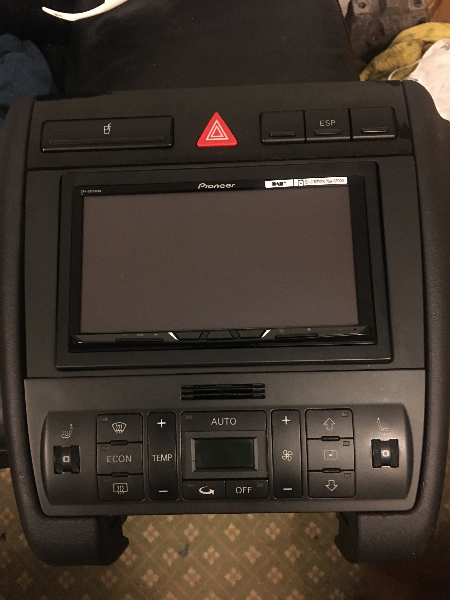
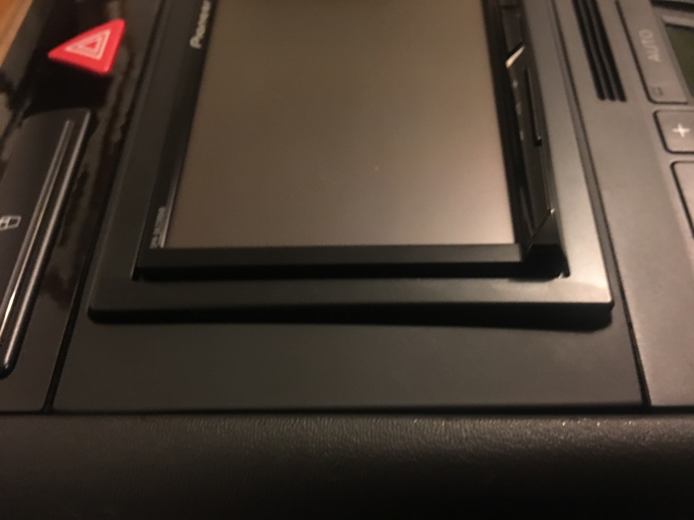
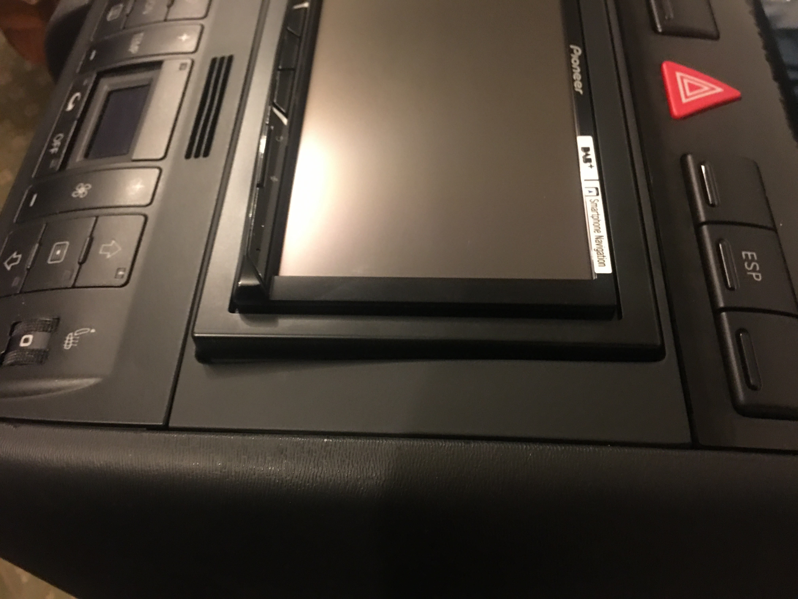

some pics with it in the car

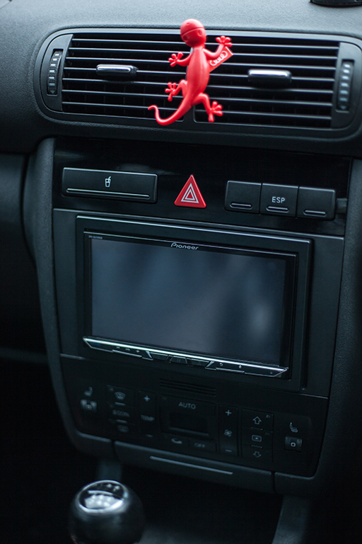
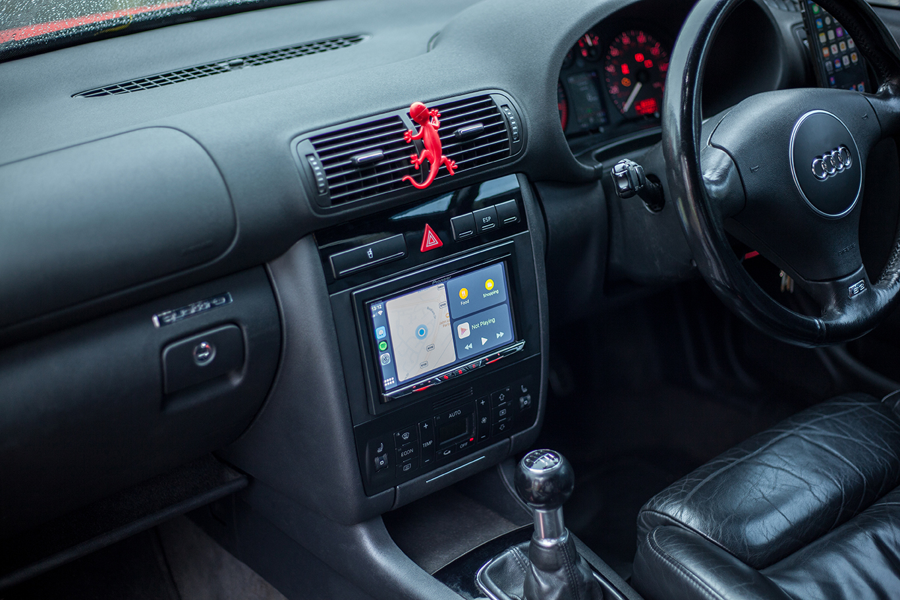